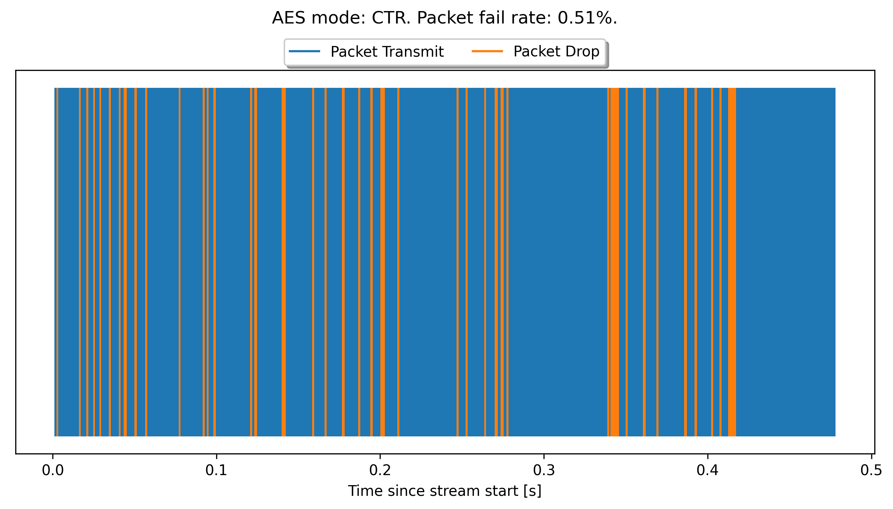
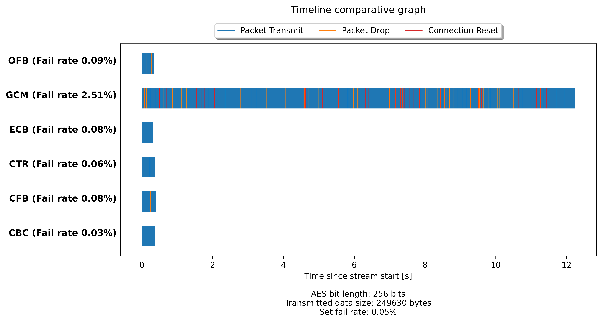

# AES Encrypted Volatile Communication
 
Bachelors thesis written on the theme of "Transmitting AES encrypted packets over a volatile communications line", where this program contains several different AES modes of operation (ECB, CBC, CTR, CFB, OFB, GCM. XTS is also implemented but it is disabled as it is not useful for this use case) and it also supports 128 and 256 bit length.

It works by loading an image, by default it is this one


Then, it will use each of the implemented AES mode where it will encrypt the image as a whole and transmit it chunk by chunk to a receiver that decrypts each chunk as it comes along. During the chunk transmission a certain number of packets will randomly be dropped, where the probability of that happening is supplied as a command line argument of this program.

The receiver has an ability to detect if any how many of the chunks are missing when it receives a new chunk, because with every transmitted chunk of encrypted data, the index of that chunk is sent along with it as unencrypted information.

In the case it detects a missing chunk, it will pad the decrypted image buffer with as many chunks as it detects there are missing. This can be seen in this image.


In this image, the communication fail rate was set to 0.5%. The program also generates a timeline graph where all of the events of the transmission and it's total duration can be seen. The timeline graph for the above image can be seen below:



Also the encrypted buffer is also saved as an image:


Where this program can also show the problems with ECB mode of operation:


---
This program also has a CLI option --update-cipher-on-packet-drop and by default it's set to True. What it does is enables/disables the receiver updating the cipher context with blocks of zero's at the same time it pads the decrypted image with blocks of zero's. When turned off, this option can demonstrate how different algorithms react when they go out of synchronization between the encryptor and the decryptor.

For example, CTR and OFB produce corrupted values after the first packet drop:


Where as some other algorithms, this is not an issue. Setting this flag can also be used to demonstrate how different modes of operation react to having their IV's or nonce's set to incorrect values.

---

Another thing that can be demonstrated is effective loss rate. For example, some algorithms can handle having their cipher contexts being filled with blocks of zero's without corrupting the rest of the data. This is shown in the CTR image posted previously


Where only black lines can be seen as the effect of padding.

This is a bit different for some algorithms like CBC, where additional randomly colored blocks can be seen next to the black blocks:


And it's related to how the mode of decryption for this particular algorithm works. This shows that in this scenario, the effective loss rate is double that of actual packet drop rate.

---

After the program finishes, it will combine all of the timeline graphs and combine them into one:



Where the summary of all of the events on all of the algorithms can be observed.
What is also observed that transfer of the file in GCM mode takes a lot longer, because the whole buffer must be transferred in whole without padding, else the GCM tag will show that the received data is invalid.

## Program usage

First, install python 3.9.11

### Windows
Download and install via [this link](https://www.python.org/downloads/release/python-3911/)

### Ubuntu
In your terminal, type

```sudo apt-get install python3.9.11```

Then, in a command line, navigate to the directory of this git and type in:

### Windows
```py -m pip install -r requirements.txt```

### Ubuntu
```python3.9.11 -m pip install -r requirements.txt```

Then run the program:

### Windows
```py main.py ...```

### Ubuntu
```python3.9.11 main.py ...```

The available command line options are:

```
usage: main.py [-h] --fail-percent FAIL_PERCENT [--image-path IMAGE_PATH] [--use-retransmission USE_RETRANSMISSION] [--update-cipher-on-packet-drop UPDATE_CIPHER_ON_PACKET_DROP]
               [--aes-bit-length {128,256}] [--aes-alg AES_ALG]

optional arguments:
  -h, --help            show this help message and exit
  --fail-percent FAIL_PERCENT
                        Transmission failure percentage
  --image-path IMAGE_PATH
                        Path to the image that will be transmitted
  --use-retransmission USE_RETRANSMISSION
                        Use retransmission on packet failure. If set to false, the missing packets will be padded with zero's
  --update-cipher-on-packet-drop UPDATE_CIPHER_ON_PACKET_DROP
                        Enable or disable the receiver updating it's cipher with zero's when a dropped packet is detected
  --aes-bit-length {128,256}
                        AES bit length
  --aes-alg AES_ALG     AES algorithm to test
```